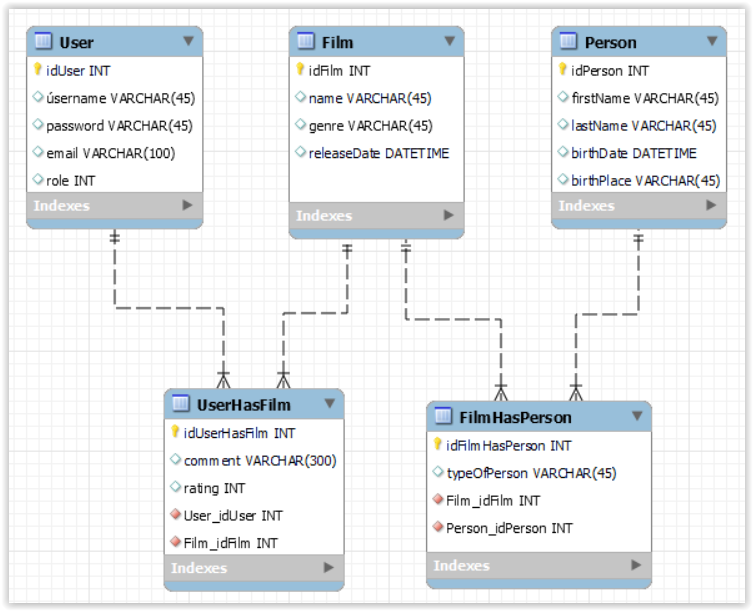

# NNPIA Semestrální práce

## Popis aplikace

Aplikace umožnňuje uživatelům hodnotit a komentovat filmy.

## Databázový model

# API
* User controller
  * [PUT]     /user/changeUserPassword/{userId} - Change user password
  * [POST]    /user/signup
  * [POST]    /user/login - Login user
  * [POST]    /user/addUser - Add user
  * [POST]    /user/addFilm
  * [GET]     /user - Get all users
  * [GET]     /user/{userId} - Get user info
  * [DELETE]  /user/{userId} - Remove user
  * [GET]     /user/getAllRoles - Get all roles

* Person-controller
  * [GET]     /person/{id}
  * [PUT]     /person/{id}
  * [GET]     /person
  * [POST]    /person
  * [DELETE]  /person/{personId}

* Film-controller
  * [GET]     /film/{id}
  * [PUT]     /film/{id}
  * [DELETE]  /film/{id}
  * [GET]     /film
  * [POST]    /film
  * [POST]    /film/addPerson
